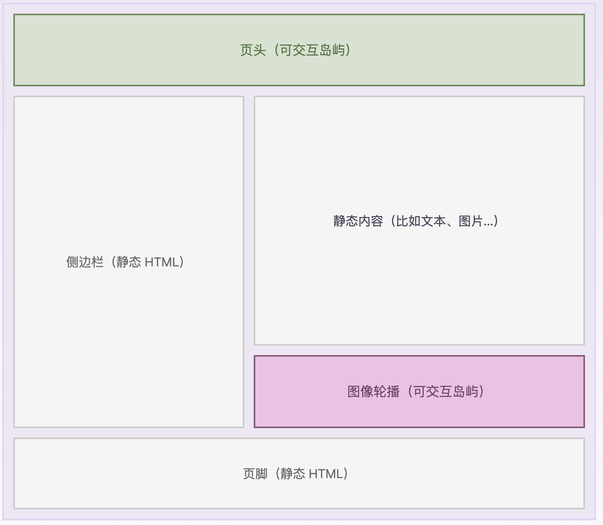

## 什么是群岛

**Astro 群岛**指的是静态 HTML 中的交互性的 UI 组件。一个页面上可以有多个岛屿，并且每个岛屿都被独立呈现。你可以将它们想象成在一片由静态（不可交互）的 HTML 页面中的动态岛屿。“群岛架构”由 Etsy 前端架构工程师[Katie Sylor-Miller](https://twitter.com/ksylor) 于 2019 年首次提出，并由 Preact 的作者 [Jason Miller](https://jasonformat.com/islands-architecture/) 在这篇文章进行了扩展。



来源：[群岛架构：Jason Miller](https://jasonformat.com/islands-architecture/)

在 Astro 中，你可以使用任何被支持的 UI 框架（比如 React, Svelte, Vue）来在浏览器中呈现群岛。你可以在一个页面中混合或拼接许多不同的框架，或者仅仅使用自己最喜欢的。

这种架构模式依赖于 partial（局部）或 selective hydration（选择性混合）技术。

## 群岛如何在 Astro 中运作

Astro 默认生成不含客户端 JavaScript 的网站。 如果使用前端框架 React、Preact、Svelte、Vue、SolidJS、AlpineJS 或 Lit，Astro 会自动提前将它们渲染为 HTML，然后再除去所有 JavaScript。这使得 Astro 创建的网站默认非常迅速，因为 Astro 帮你自动清除了所有页面上的 JavaScript。

```astro
---
// 例子：在此页面使用一个静态的 Vue 组件，没有 JavaScript。
import MyVueComponent from '../components/MyVueComponent.vue';
---
<!-- 100% HTML，没有 JavaScript 在这个页面上！ -->
<MyVueComponent />
```

但是有些时候，响应式的 UI 是需要客户端 JavaScript 的。你不该将整个页面做成一个像 SPA（单页面应用）一样的 JavaScript 应用，相反，Astro 允许你创建岛屿。

```astro
---
// 例子：在此页面上使用一个动态 Vue 组件
---
<!-- 现在这个组件是可交互性的了！
  网站的其他部分仍然是静态、没有JavaScript的。 -->
<MyVueComponent client:only="vue" />
```

使用 Astro 群岛，你的大部分页面保持着纯正、轻盈的 HTML 和 CSS。在上面的例子中，你仅仅添加了一个简单的、孤立的可响应岛屿，而并没有改变任何页面其他部分的代码。
