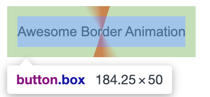

import RepeatingConicGradientStepTwo from '../front-end-dev/components/css/RepeatingConicGradientStepTwo.vue';
import RepeatingConicGradient from '../front-end-dev/components/css/RepeatingConicGradient.vue';

## Contents

## 前置知识

- [repeating-conic-gradient](https://developer.mozilla.org/en-US/docs/Web/CSS/gradient/repeating-conic-gradient)
- [@property](https://developer.mozilla.org/zh-CN/docs/Web/CSS/@property)
- [animation](https://developer.mozilla.org/zh-CN/docs/Web/CSS/animation)

## 实现步骤

### 创建带重复圆锥渐变背景图像的按钮

先创建一个按钮元素，使用`repeating-conic-gradient`语法给按钮添加一个重复圆锥渐变背景的图像。得到如下效果按钮:



代码示例如下：

```html
<button class="box"> Awesome Border Animation </button>
```

```css
.box {
  padding: 10px;
  height: 50px;
  border: none;
  outline: none;
  background: repeating-conic-gradient(#ff2700 0%, #ff2700 5%, transparent 5%, transparent 40%, #ff2700 50%);
}
```

### 给按钮背景添加animation动效

给button元素加上animation动画,启用需要用到`@property`自定义一个angel属性,然后使用animation keyframes让background的动画帧动起来。

```css
@property --angle {
  syntax: '<angle>';
  inherits: false;
  initial-value: 0deg;
}
```

```css
.box {
  padding: 10px;
  height: 50px;
  border: none;
  outline: none;
  background: repeating-conic-gradient(
    from var(--angle),
    #ff2700 0%,
    #ff2700 5%,
    transparent 5%,
    transparent 40%,
    #ff2700 50%
  );
  animation: animation 4s linear infinite;
}

.box::after {
  position: absolute;
  content: '';
  inset: 4px;
}
```


```css
@keyframes animation {
  0% {
    --angle: 0deg;
  }
  100% {
    --angle: 360deg;
  }
}
```


实现了如效果:

<RepeatingConicGradientStepTwo />

### 为按钮添加::after伪元素

给按钮元素添加::after伪元素，添加背景以及边框,同时给按钮元素添加z-index层级，让其层级高于after伪元素。

```css
.box::after {
  content: '';
  position: absolute;
  inset: 3px;
  background: #232323;
  border: 2px solid #232323;
  z-index: -1;
  border-radius: 12px;
}
```

```css
.box {
padding: 10px;
  height: 50px;
  border: none;
  outline: none;
  background: repeating-conic-gradient(
    from var(--angle),
    #ff2700 0%,
    #ff2700 5%,
    transparent 5%,
    transparent 40%,
    #ff2700 50%
  );
  animation: animation 4s linear infinite;
  /* some extra css property */
  color: #fff;
  position: relative;
  z-index: 0;
  border-radius: 12px;
}
```

## 成品

### 成品效果

<RepeatingConicGradient />

### 完整代码

```vue
<template>
  <div>
    <button class="box">Awesome Border Animation</button>
  </div>
</template>

<script setup lang="ts"></script>

<style scoped lang="css">
  @property --angle {
    syntax: '<angle>';
    inherits: false;
    initial-value: 0deg;
  }

  .box {
    padding: 10px;
    height: 50px;
    border: none;
    outline: none;
    appearance: none;
    background: repeating-conic-gradient(
      from var(--angle),
      #ff2700 0%,
      #ff2700 5%,
      transparent 5%,
      transparent 40%,
      #ff2700 50%
    );
    animation: animation 4s linear infinite;
    color: #fff;
    position: relative;
    z-index: 0;
    border-radius: 12px;
  }

  .box::after {
    content: '';
    position: absolute;
    inset: 3px;
    background: #232323;
    border: 2px solid #232323;
    z-index: -1;
    border-radius: 12px;
  }

  @keyframes animation {
    0% {
      --angle: 0deg;
    }
    100% {
      --angle: 360deg;
    }
  }
</style>
```
