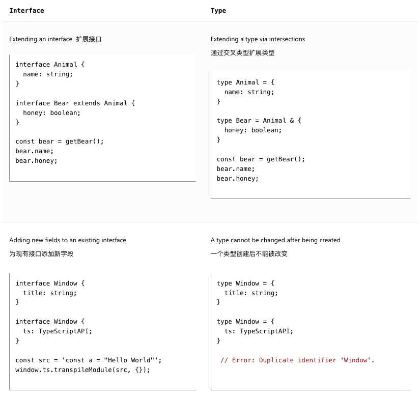

## Contents

## Primitives Types

- number: 表示整数、浮点数等数值类型。
- string: 表示用单引号（''）或双引号（"）包围的文本数据。
- boolean: 表示逻辑值，可以是 true 或 false 。
- null: 表示没有任何对象值。
- undefined: 表示未初始化的变量或缺乏值的对象。
- void: void 代表不返回值的函数的返回值。当函数没有任何 return 语句，或者从这些 return 语句中没有显式返回任何值时

```typescript
// The inferred return type is void
function noop() {
  return
}

function noReturn() {}
```

## Arrays

```typescript
type NumberArrayT = number[]
type StrArrayT = string[]
```

> 请注意 [number] 是不同的事物；参考元组部分。

## Any

any 类型在你不想为了说服 TypeScript 某行代码是正确的而写出冗长类型时很有用。一般在项目中少用

## Type Annotations on Variables

```typescript
let str: string = '1'
let num: number = 1
```

不过，在大多数情况下，这并非必需的。TypeScript 尽可能自动推断代码中的类型。例如，变量的类型是根据其初始值的类型推断的：

```typescript
const username = ref('Yeeee')
const nickname = ref<string>()
```

## Functions

函数是 JavaScript 中传递数据的主要方式。TypeScript 允许你指定函数输入和输出值的类型。

### Parameter Type Annotations

```typescript
function greet(name: string) {
  console.log('Hello, ' + name.toUpperCase() + '!!')
}
```

### Return Type Annotations

```typescript
function getFavoriteNumber(): number {
  return 26
}
```

### Functions Which Return Promises

```typescript
async function getFavoriteNumber(): Promise<number> {
  return 26
}
```

### Anonymous Functions

匿名函数与函数声明略有不同。当函数出现在 TypeScript 可以确定其调用方式的场合时，该函数的参数会自动被赋予类型。

```typescript
let strList = ['1', '2', '3']
strList.forEach((item) => console.log(item.toUpperCase()))
```

在ts文件中，item将自动被推断为string类型

## Object Types

在开发中，除了原始类型外常见的便是对象类型，要定义一个对象类型，我们只需列出其属性及其类型。

```typescript
interface Person {
  name: string
  age: number
}
```

- Interface
- Class
- Enum
- Array
- Tuple
- Object

### Optional Properties

对象类型也可以指定其某些或所有属性是可选的。要这样做，在属性名后添加 ? ：

```typescript
interface Person {
  name: string
  age: number
  address?: string
}
```

## Union Types

提供匹配联合类型的值很简单——只需提供一个与联合类型中的任何成员匹配的类型。

### Defining a Union Type

```typescript
type TMixin =
  | {
      name: string
      age: number
    }
  | string
  | number

const a: TMixin = '1'
const b: TMixin = 1
const c: TMixin = {
  name: '1',
  age: 1
}
```

### Working with Union Types 处理联合类型

```typescript
function printMixinType(payload: TMixin) {
  console.log('payload', payload)
  if (typeof payload === 'object') {
    console.log('payload is object', payload)
  } else if (typeof payload === 'string') {
    console.log('payload is string', payload)
  } else if (typeof payload === 'number') {
    console.log('payload is number', payload)
  }
}
```

## Type Aliases 类型别名

通常我们希望多次使用相同的类型，并用一个名称来引用它,从而实现重复使用。可以使用类型别名为任何类型命名，而不仅仅是对象类型。 可以是基础类型，也可以是联合类型，还可以是对象类型。

```typescript
type TbooleanStrNum = boolean | string | number

function inputTypeAliases(t: TbooleanStrNum) {
  console.log('t', t)
}

type TComplex =
  | TbooleanStrNum
  | {
      name: string
      age: number
    }

type TComplex =
  | TbooleanStrNum
  | {
      name: string
      age: number
    }

function inputComplexType(t: TComplex) {
  console.log('t', t)
}

inputTypeAliases(true)
inputTypeAliases('1')
inputTypeAliases(1)

inputComplexType({
  name: '1',
  age: 1
})
```

## Interfaces

接口声明是另一种命名对象类型的方式

```typescript
interface Point {
  x: number
  y: number
}

function printCoord(pt: Point) {
  console.log("The coordinate's x value is " + pt.x)
  console.log("The coordinate's y value is " + pt.y)
}

printCoord({ x: 100, y: 100 })
```

就像我们上面使用类型别名一样，这个例子也像我们使用了匿名对象类型一样工作。TypeScript 只关心我们传递给 printCoord 的值的结构——它只关心它具有预期的属性。TypeScript 只关心类型的结构和能力，这就是为什么我们将它称为结构化类型系统。

### Differences Between Type Aliases and Interfaces

类型别名和接口非常相似，在许多情况下你可以自由选择它们。 interface 的几乎所有特性在 type 中都可用，关键的区别在于类型不能重新打开以添加新属性，而接口总是可以扩展的。



## Type Assertions

有时你会对某个值的类型有信息，而 TypeScript 无法知道。这个时候可以使用断言来明确告诉typescript更具体的类型。但是在实际使用过程中，我们尽量使用 Narrowing类型缩小来完成具体类型的处理。

```typescript
const myCanvas = document.getElementById('main_canvas') as HTMLCanvasElement

// const myCanvas = <HTMLCanvasElement>document.getElementById("main_canvas"); // valid

// const myCanvas: HTMLCanvasElement = document.getElementById("main_canvas"); // invalid
```

TypeScript 只允许将类型转换为更具体或更不具体的版本。这条规则防止了“不可能”的类型转换，例如：

```typescript
const x = 'hello' as number

// Conversion of type 'string' to type 'number' may be a mistake because neither type sufficiently overlaps with the other. If this was intentional, convert the expression to 'unknown' first.
```

## Literal Types

除了通用的类型 string 和 number 之外，我们还可以在类型位置引用特定的字符串和数字。比如说后端定义的枚举值，类型，状态等

```typescript
type TStatus = 'pending' | 'runing' | 'completed' | 'archived'
type TNums = 1 | 2 | 4
```

用处

- 将字面量组合成联合类型，你可以表达一个更实用的概念，指定函数特定的入参
- 将这些与非字面量类型结合使用
- 模版字面量类型的扩展

### Literal Inference

```typescript
declare function handleRequest(url: string, method: 'GET' | 'POST'): void

const req = { url: 'https://example.com', method: 'GET' }
handleRequest(req.url, req.method)
// Argument of type 'string' is not assignable to parameter of type '"GET" | "POST"'.
```

在上面的例子中 req.method 被推断为 string ，而不是 "GET" 。因为代码可以在 req 创建和 handleRequest 调用之间被评估，这可能会将新的字符串 "GUESS" 赋值给 req.method ，TypeScript 认为这段代码存在错误。

解决错误的方法

1. 在变量定义处增加类型注释

```typescript
const req: { url: string; method: 'GET' | 'POST' } = { url: 'https://example.com', method: 'GET' }
```

2. 属性断言

```typescript
// Change 1:
const req = { url: 'https://example.com', method: 'GET' as 'GET' }
```

3. 你可以使用 as const 将整个对象转换为类型字面量：

```typescript
const req = { url: 'https://example.com', method: 'GET' } as const
handleRequest(req.url, req.method)
```

## Enums

枚举是 TypeScript 为 JavaScript 添加的一项功能，它允许描述一个可能是一组命名常量之一的值。与大多数 TypeScript 功能不同，这不是对 JavaScript 的类型级别补充，而是对语言和运行时的补充

## Less Common Primitives

### bigint

从 ES2020 开始，JavaScript 中有一个用于非常大的整数的原始类型

### symbol

JavaScript 中有一个原始类型，可以通过函数 Symbol() 创建一个全局唯一的引用：

```typescript
const firstName = Symbol("name");
const secondName = Symbol("name");

if (firstName === secondName) {
// This comparison appears to be unintentional because the types 'typeof firstName' and 'typeof secondName' have no overlap.
//   // Can't ever happen
// }
```

## 参考文档

- [TypeScript Handbook](https://www.typescriptlang.org/docs/handbook/2/everyday-types.html)。
- [TypeScript Roadmap](https://roadmap.sh/typescript)。
- [理解 TypeScript 类型：基本类型、对象和类型操作](https://dev.to/rajrathod/understanding-typescript-types-primitives-objects-and-type-manipulations-bjj)。
