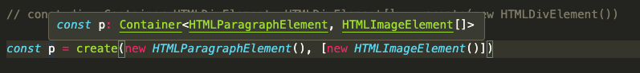
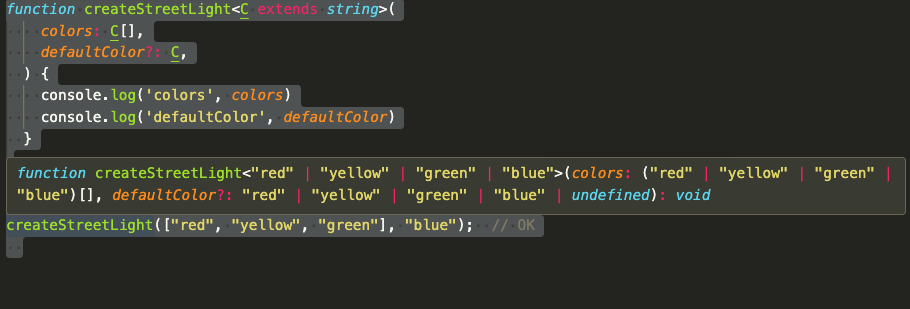

## Contents

## TypeScript Generics

TypeScript 中的泛型允许你创建可适用于不同类型的可重用组件或函数。它们提供了一种参数化类型的方式，能够创建灵活且类型安全的代码。

### Generic Functions

你可以通过在尖括号（ <> ）内指定一个类型参数来定义一个泛型函数。这个类型参数可以用作函数调用时特定类型的占位符：

```typescript
function identity<T>(arg: T): T {
  return arg
}

let result = identity<string>('Hello')
console.log(result) // Output: "Hello"

let numberResult = identity<number>(42)
console.log(numberResult) // Output: 42
```

在上述 identity 函数中，类型参数 T 代表一个泛型类型。当函数被调用时，提供的参数的类型将被推断，或者你也可以在尖括号内显式指定类型。

### Generic Interfaces

```typescript
interface Container<T> {
  value: T
}

let container1: Container<number> = { value: 42 }
console.log(container1.value) // Output: 42

let container2: Container<string> = { value: 'Hello' }
console.log(container2.value) // Output: "Hello"
```

在 Container 接口中，类型参数 T 用于定义 value 属性。在实现接口时，你可以为 T 指定实际类型。

在项目中我们常用的ant-design-vue的columns定义就是常见的接收泛型类型参数的示例

```typescript
const columns: TableProps<IGlobalSearchAsin>['columns'] = [
  {
    title: '图片',
    dataIndex: 'img_link',
    width: 100
  },
  {
    title: '操作',
    dataIndex: 'action',
    width: 100,
    customRender(opt) {
      // 传入具体的泛型类型之后，record能获得具体的泛型参数 IGlobalSearchAsin。
      console.log(opt.record)
    }
  }
]
```

### Generic Classes

泛型类与泛型接口具有相似的形状。泛型类在类名后面的尖括号 ( <> ) 中有一个泛型类型参数列表。

```typescript
class GenericNumber<NumType> {
  zeroValue: NumType
  add: (x: NumType, y: NumType) => NumType
}

let myGenericNumber = new GenericNumber<number>()
myGenericNumber.zeroValue = 0
myGenericNumber.add = function (x, y) {
  return x + y
}
```

这是一个相当字面意义上的 GenericNumber 类使用，但你可能已经注意到没有任何东西限制它只能使用 number 类型。我们本可以使用 string ，甚至更复杂的对象

```typescript
let stringNumeric = new GenericNumber<string>()
stringNumeric.zeroValue = ''
stringNumeric.add = function (x, y) {
  return x + y
}

console.log(stringNumeric.add(stringNumeric.zeroValue, 'test'))
```

和接口一样，将类型参数放在类本身上，可以确保类的所有属性都使用相同的类型。一个类的类型有两个方面：静态方面和实例方面。泛型类仅在其实例方面是泛型的，而不是在静态方面，因此在使用类时，静态成员不能使用类的类型参数。

### Generic Constraints

TypeScript 中的泛型约束允许你限制可以与泛型类型参数一起使用的类型。通过指定约束，你可以确保泛型类型参数满足某些条件，例如具有特定属性或实现某些接口。这有助于提供更具体的类型信息，并能够使用特定于约束类型的属性或方法。示例1:

```typescript
interface Animal {
  name: string
  age: number
}

function getOldest<T extends Animal>(animals: T[]): T {
  let oldest: T | null = null

  for (const animal of animals) {
    if (oldest === null || animal.age > oldest.age) {
      oldest = animal
    }
  }

  if (!oldest) {
    throw new Error('No animals found')
  }

  return oldest
}

const animals: Animal[] = [
  { name: 'Dog', age: 5 },
  { name: 'Cat', age: 7 },
  { name: 'Rabbit', age: 3 }
]

const oldestAnimal = getOldest(animals)
console.log(oldestAnimal.name) // Output: "Cat"
console.log(oldestAnimal.age) // Output: 7
```

在上面的示例中，我们有一个泛型函数 getOldest ，它从动物数组中找出最老的动物。泛型类型参数 T 被约束为 Animal ，这意味着 T 必须是 Animal 的子类型，并且必须定义 name 和 age 属性。

通过使用 extends 关键字和 Animal 接口（ T extends Animal ），我们确保只有满足 Animal 接口类型的值才能与该函数一起使用。这提供了类型安全性，并允许我们在返回的对象上无类型错误地访问 name 和 age 属性。

通过使用泛型约束，你可以创建更具体且可重用的函数，这些函数仅在受限类型集上操作。它允许你利用特定于约束类型的属性和方法，确保类型安全并增强代码清晰度。

示例2

```typescript
function getProperty<Type, Key extends keyof Type>(obj: Type, key: Key) {
  return obj[key]
}

let x = { a: 1, b: 2, c: 3, d: 4 }

getProperty(x, 'a')
getProperty(x, 'm')

// Argument of type '"m"' is not assignable to parameter of type '"a" | "b" | "c" | "d"'.
```

这里我们希望从一个对象中根据其名称获取一个属性。我们希望确保不会不小心获取到 obj 上不存在的属性，因此我们将在两个类型之间添加一个约束：

### Generic Parameter Defaults

通过为泛型类型参数声明默认值，你可以选择性地指定相应的类型参数。例如，一个创建新 HTMLElement 的函数。调用该函数时不带任何参数会生成 HTMLDivElement ；调用该函数并将一个元素作为第一个参数会生成该参数类型的元素。你也可以选择性地传递一个子元素列表。以前你需要这样定义该函数：

```typescript
declare function create(): Container<HTMLDivElement, HTMLDivElement[]>
declare function create<T extends HTMLElement>(element: T): Container<T, T[]>
declare function create<T extends HTMLElement, U extends HTMLElement>(element: T, children: U[]): Container<T, U[]>
```

使用泛型参数默认值，我们可以将其简化为：

```typescript
interface Container<T, U> {
  element: T
  children: U
}

declare function create<T extends HTMLElement = HTMLDivElement, U extends HTMLElement[] = T[]>(
  element?: T,
  children?: U
): Container<T, U>

const div = create()

const div: Container<HTMLDivElement, HTMLDivElement[]>

const p = create(new HTMLParagraphElement())
```

泛型参数默认值遵循以下规则：

- 类型参数如果有默认值，则被视为可选。
- 必需的类型参数不能跟在可选的类型参数后面。
- 类型参数的默认类型必须满足该类型参数的约束（如果存在）,如下示例则会报错不满足类型参数约束。
  ```typescript
  declare function create<T extends HTMLCanvasElement = HTMLDivElement, U extends HTMLCanvasElement[] = T[]>(
    element?: T,
    children?: U
  ): Container<T, U>
  // 类型“HTMLDivElement”不满足约束“HTMLCanvasElement”
  ```
- 在指定类型参数时，你只需要指定必需的类型参数的类型参数。未指定的类型参数将解析为其默认类型。 
- 如果指定了默认类型且推断无法选择候选类型，则推断默认类型。
- 与现有类或接口声明合并的类或接口声明可以引入现有类型参数的默认值。
- 与现有类或接口声明合并的类或接口声明可以引入新的类型参数，只要它指定了默认值。

## Utility Types

TypeScript 提供了多种工具类型来简化常见的类型转换。这些工具类型是全局可用的。

### Awaited<Type>

此类型用于模拟 await 函数中的操作，或在 async 上的 .then() 方法——具体来说，是指它们递归地解包 Promise 的方式。

```typescript
type A = Awaited<Promise<string>>

type A = string

type B = Awaited<Promise<Promise<number>>>

type B = number

type C = Awaited<boolean | Promise<number>>
```

### Partial<Type>

构建一个所有属性都设为可选的类型。此工具将返回一个表示给定类型所有子集的类型。

```typescript
interface Animal {
  age: number
  weight: string
}

function updateAnimal(animal: Animal, fieldsToUpdate: Partial<Animal>) {
  return { ...animal, ...fieldsToUpdate }
}

const animal1 = {
  age: 1,
  weight: '10KG'
}

const animal2 = updateAnimal(animal1, {
  weight: '10Pound'
})
```

### Required<Type>

构建一个所有属性都设为必填的类型。与 Partial 相反。

```typescript
interface Props {
  a?: number
  b?: string
}

const obj: Props = { a: 5 }

const obj2: Required<Props> = { a: 5 }
// Property 'b' is missing in type '{ a: number; }' but required in type 'Required<Props>'.
```

### Readonly<Type>

构建一个类型，其中所有属性都设置为 Type ，这意味着构建的类型属性不能重新赋值。

```typescript
interface Todo {
  title: string
}

const todo: Readonly<Todo> = {
  title: 'Delete inactive users'
}

todo.title = 'Hello'
// Cannot assign to 'title' because it is a read-only property.
```

这个工具适用于表示在运行时将失败（即尝试重新赋值冻结对象的属性）的赋值表达式。

`Object.freeze`

```typescript
function freeze<Type>(obj: Type): Readonly<Type>
```

### Record<Keys, Type>

构建一个对象类型，其属性键为 Keys ，属性值为 Type 。这个工具可用于将一个类型的属性映射到另一个类型。

```typescript
type CatName = 'miffy' | 'boris' | 'mordred'

interface CatInfo {
  age: number
  breed: string
}

const cats: Record<CatName, CatInfo> = {
  miffy: { age: 10, breed: 'Persian' },
  boris: { age: 5, breed: 'Maine Coon' },
  mordred: { age: 16, breed: 'British Shorthair' }
}

cats.boris

const cats: Record<CatName, CatInfo>
```

```typescript
export type AsinOperatingAdverItem = {
  date: string
  acos: number
  cpc: number
  cr: number
  ctr: number
  sum_orders: number
  sum_same_sku_orders: number
  sum_sales: number
  sum_clicks: number
  sum_cost: number
  sum_impressions: number
  pull_datetime: string
  sum_ad_all_sku_orders: number
  sum_ad_all_sku_sales: number
  sum_ad_all_sku_units: number
}
export type AdType = 'sp' | 'sd' | 'sd_vcpm' | 'sb_video'

// 映射出新的AsinOperatingAdverList类型
export type AsinOperatingAdverList = Record<AdType, AsinOperatingAdverItem[] | null>
```

### Pick<Type, Keys>

通过从 Type 中挑选出 Keys （字面量字符串或字面量字符串的联合）来构造一个类型。

```typescript
interface Todo {
  title: string
  description: string
  completed: boolean
}

type TodoPreview = Pick<Todo, 'title' | 'completed'>

const todo: TodoPreview = {
  title: 'Clean room',
  completed: false
}

todo
```

### Omit<Type, Keys>

通过从 Type 中选取所有属性，然后移除 Keys （字面量字符串或字面量字符串的联合）来构造一个类型。它与 Pick 相反。

```typescript
interface Todo {
  title: string
  description: string
  completed: boolean
  createdAt: number
}

type TodoPreview = Omit<Todo, 'description'>

const todo: TodoPreview = {
  title: 'Clean room',
  completed: false,
  createdAt: 1615544252770
}

todo

const todo: TodoPreview

type TodoInfo = Omit<Todo, 'completed' | 'createdAt'>

const todoInfo: TodoInfo = {
  title: 'Pick up kids',
  description: 'Kindergarten closes at 5pm'
}

todoInfo
```

### Exclude<UnionType, ExcludedMembers>

通过从 UnionType 中排除所有可分配给 ExcludedMembers 的联合成员来构建一个类型。

```typescript
type T0 = Exclude<'a' | 'b' | 'c', 'a'>

// type T0 = "b" | "c"
type T1 = Exclude<'a' | 'b' | 'c', 'a' | 'b'>

// type T1 = "c"
type T2 = Exclude<string | number | (() => void), Function>

// type T2 = string | number

type Shape =
  | { kind: 'circle'; radius: number }
  | { kind: 'square'; x: number }
  | { kind: 'triangle'; x: number; y: number }

type T3 = Exclude<Shape, { kind: 'circle' }>

// type T3 = {
//     kind: "square";
//     x: number;
// } | {
//     kind: "triangle";
//     x: number;
//     y: number;
// }
```

### Extract<Type, Union>

通过从 Type 中提取所有可分配给 Union 的联合成员来构建一个类型。

```typescript
type T0 = Extract<'a' | 'b' | 'c', 'a' | 'f'>

// type T0 = "a"
type T1 = Extract<string | number | (() => void), Function>

// type T1 = () => void

type Shape =
  | { kind: 'circle'; radius: number }
  | { kind: 'square'; x: number }
  | { kind: 'triangle'; x: number; y: number }

type T2 = Extract<Shape, { kind: 'circle' }>

// type T2 = {
//     kind: "circle";
//     radius: number;
// }
```

### NonNullable<Type>

通过从 Type 中排除 null 和 undefined 来构造一个类型。

```typescript
type T0 = NonNullable<string | number | undefined>

// type T0 = string | number
type T1 = NonNullable<string[] | null | undefined>

// type T1 = string[]

type PaiginationT = Exclude<NonNullable<TableProps['pagination']>, boolean>
```

### Parameters<Type>

从函数类型 Type 的参数中使用的类型构建一个元组类型。

对于重载函数，这将是最后一个签名的参数;

```typescript
declare function f1(arg: { a: number; b: string }): void

type T0 = Parameters<() => string>

// type T0 = []
type T1 = Parameters<(s: string) => void>

// type T1 = [s: string]
type T2 = Parameters<<T>(arg: T) => T>

// type T2 = [arg: unknown]
type T3 = Parameters<typeof f1>

// type T3 = [arg: {
//     a: number;
//     b: string;
// }]
type T4 = Parameters<any>

// type T4 = unknown[]
type T5 = Parameters<never>

// type T5 = never
type T6 = Parameters<string>
// Type 'string' does not satisfy the constraint '(...args: any) => any'.

// type T6 = never
type T7 = Parameters<Function>
// Type 'Function' does not satisfy the constraint '(...args: any) => any'.
//   Type 'Function' provides no match for the signature '(...args: any): any'.

// type T7 = never
```

### ConstructorParameters<Type>

从*构造函数*类型中构建一个元组或数组类型。它产生一个包含所有参数类型的元组类型（如果 Type 不是一个函数，则产生类型 never ）。

```typescript
type T0 = ConstructorParameters<ErrorConstructor>

// type T0 = [message?: string]
type T1 = ConstructorParameters<FunctionConstructor>

// type T1 = string[]
type T2 = ConstructorParameters<RegExpConstructor>

// type T2 = [pattern: string | RegExp, flags?: string]
class C {
  constructor(a: number, b: string) {}
}
type T3 = ConstructorParameters<typeof C>

// type T3 = [a: number, b: string]
type T4 = ConstructorParameters<any>

// type T4 = unknown[]

type T5 = ConstructorParameters<Function>
// Type 'Function' does not satisfy the constraint 'abstract new (...args: any) => any'.
//   Type 'Function' provides no match for the signature 'new (...args: any): any'.

// type T5 = never
```

### ReturnType<Type>

构建一个由函数 Type 的返回类型组成的类型。对于重载函数，这将是最后一个签名的返回类型;

```typescript
declare function f1(): { a: number; b: string }

type T0 = ReturnType<() => string>

// type T0 = string
type T1 = ReturnType<(s: string) => void>

// type T1 = void
type T2 = ReturnType<<T>() => T>

// type T2 = unknown
type T3 = ReturnType<<T extends U, U extends number[]>() => T>

// type T3 = number[]
type T4 = ReturnType<typeof f1>

// type T4 = {
//     a: number;
//     b: string;
// }
type T5 = ReturnType<any>

// type T5 = any
type T6 = ReturnType<never>

// type T6 = never
type T7 = ReturnType<string>
// Type 'string' does not satisfy the constraint '(...args: any) => any'.

// type T7 = any
type T8 = ReturnType<Function>
// Type 'Function' does not satisfy the constraint '(...args: any) => any'.
//   Type 'Function' provides no match for the signature '(...args: any): any'.

// type T8 = any
```

### InstanceType<Type>

构建一个由构造函数在 Type 中的实例类型组成的类型。项目中使用使用该工具类型获取Vue组件内的方法或者对外暴露的属性。

```typescript
const adSelectorRef = ref<InstanceType<typeof AdSelector>>()
```

### NoInfer<Type>

阻止对包含类型的TS推断。除了阻止推断之外， NoInfer<Type> 与 Type 完全相同。

defaultColor使用： `NoInfer<C>`,阻断TS对 C 参数的额外推断，防止将blue参数也加入推断的类型内。

```typescript
function createStreetLight<C extends string>(colors: C[], defaultColor?: NoInfer<C>) {
  // ...
}
createStreetLight(['red', 'yellow', 'green'], 'red') // OK
createStreetLight(['red', 'yellow', 'green'], 'blue') // Error
```

如果defaultColor不使用`NoInfer<C>`，则`createStreetLight`的泛型将是如下图所示的类型

```typescript
function createStreetLight<C extends string>(colors: C[], defaultColor?: C) {
  console.log('colors', colors)
  console.log('defaultColor', defaultColor)
}

createStreetLight(['red', 'yellow', 'green'], 'red') // OK
createStreetLight(['red', 'yellow', 'green'], 'blue') // OK
```



### ThisParameterType<Type>

提取函数类型的 this 参数的类型，如果函数类型没有 this 参数，则为 unknown。

```typescript
function toHex(this: Number) {
  return this.toString(16)
}

function numberToString(n: ThisParameterType<typeof toHex>) {
  return toHex.apply(n)
}
```

### OmitThisParameter<Type>

移除 Type 中的 this 参数。如果 Type 没有显式声明的 this 参数，结果就是 Type 。否则，会从 Type 创建一个新的不带 this 参数的函数类型。泛型会被擦除，只有最后一个重载签名会被传播到新的函数类型中。

```typescript
function toHex(this: Number) {
  return this.toString(16)
}

const fiveToHex: OmitThisParameter<typeof toHex> = toHex.bind(5)

console.log(fiveToHex())
// const fiveToHex: () => string
```

### Intrinsic String Manipulation Types

- Uppercase<StringType>
- Lowercase<StringType>
- Capitalize<StringType>
- Uncapitalize<StringType>

### Template Literal Types推断

当联合类型用于插值位置时，该类型是每个联合成员可以表示的所有可能的字符串字面量的集合：

```typescript
type EmailLocaleIDs = 'welcome_email' | 'email_heading'
type FooterLocaleIDs = 'footer_title' | 'footer_sendoff'

type AllLocaleIDs = `${EmailLocaleIDs | FooterLocaleIDs}_id`
// type AllLocaleIDs = "welcome_email_id" | "email_heading_id" | "footer_title_id" | "footer_sendoff_id"
```

在每个模板字面量的插值位置，联合类型会进行交叉乘积：

```typescript
type AllLocaleIDs = `${EmailLocaleIDs | FooterLocaleIDs}_id`
type Lang = 'en' | 'ja' | 'pt'

type LocaleMessageIDs = `${Lang}_${AllLocaleIDs}`

// type LocaleMessageIDs = "en_welcome_email_id" | "en_email_heading_id" | "en_footer_title_id" | "en_footer_sendoff_id" | "ja_welcome_email_id" | "ja_email_heading_id" | "ja_footer_title_id" | "ja_footer_sendoff_id" | "pt_welcome_email_id" | "pt_email_heading_id" | "pt_footer_title_id" | "pt_footer_sendoff_id"
```

## Recursive types

递归类型，也称为自引用类型，是在其自身定义中引用自身的类型。它们允许你创建包含对自身结构中相同类型引用的数据结构或类型。在处理嵌套或层次结构的数据时，递归类型非常有用。以下是几个递归类型的例子：

### Linked List

```typescript
interface ListNode<T> {
  value: T
  next?: ListNode<T>
}

const node1: ListNode<number> = { value: 1 }
const node2: ListNode<number> = { value: 2 }
const node3: ListNode<number> = { value: 3 }

node1.next = node2
node2.next = node3
```

### Binary Tree

```typescript
interface TreeNode<T> {
  value: T
  left?: TreeNode<T>
  right?: TreeNode<T>
}

const nodeA: TreeNode<string> = { value: 'A' }
const nodeB: TreeNode<string> = { value: 'B' }
const nodeC: TreeNode<string> = { value: 'C' }

nodeA.left = nodeB
nodeA.right = nodeC
```

### Nested Objects

```typescript
interface Person {
  name: string
  children?: Person[]
}

const personA: Person = { name: 'Alice' }
const personB: Person = { name: 'Bob' }
const personC: Person = { name: 'Charlie' }

personA.children = [personB, personC]
```

## 参考文档

- [TypeScript Handbook-Generic](https://www.typescriptlang.org/docs/handbook/2/generics.html#using-type-parameters-in-generic-constraints)。
- [TypeScript Handbook-Template Literal Types](https://www.typescriptlang.org/docs/handbook/2/template-literal-types.html)
- [TypeScript Handbook-Utility Types](https://www.typescriptlang.org/docs/handbook/utility-types.html)
- [TypeScript Roadmap](https://roadmap.sh/typescript)。
- [探索 TypeScript 泛型的强大：约束、实用类型、字面量类型和递归结构](https://dev.to/rajrathod/exploring-the-power-of-typescript-generics-constraints-utility-types-literal-types-and-recursive-structures-78g)。
